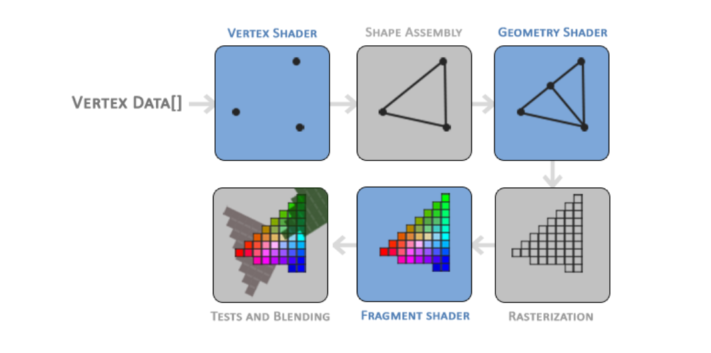
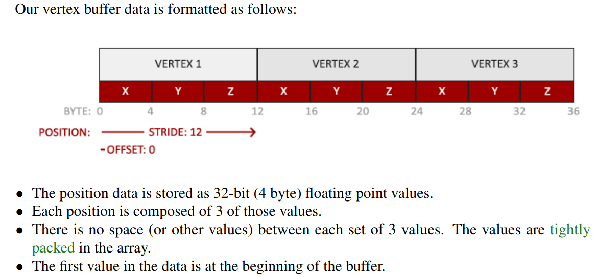
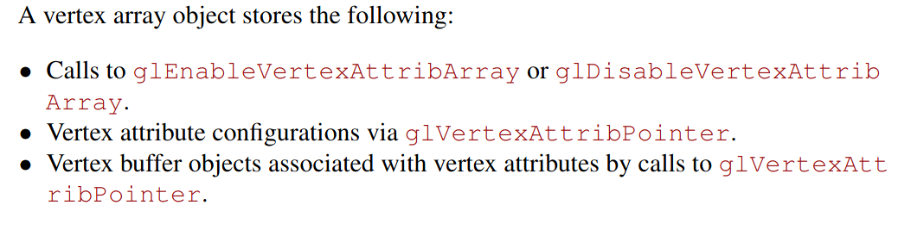
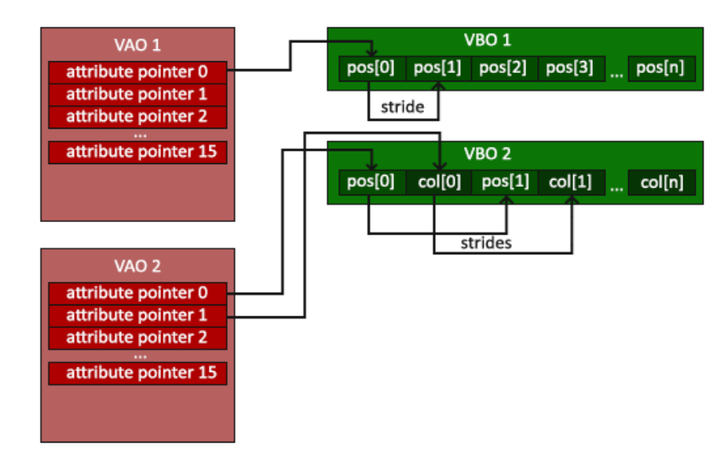
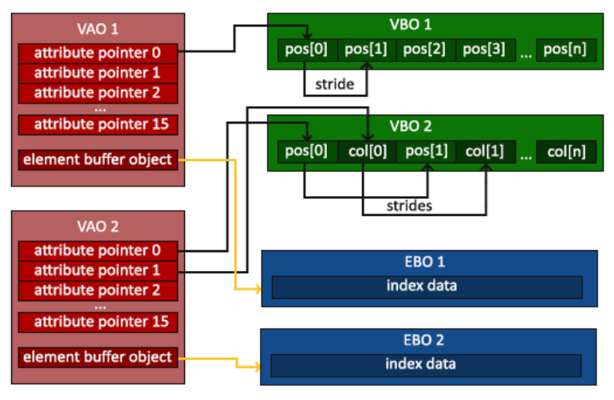
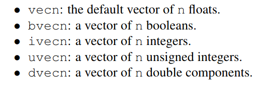

# particle-system

### [OpenGl3 book](https://learnopengl.com/book/book_pdf.pdf)
## Notes
- Stages of graphics pipeline for shaders:

-  Vertex buffer objects (VBO)
   -  Can store a large number of vertices in the GPU memory. Since sending data to the gpu is costly.
   -  Each VBO has a unique buffer id. Using the buffer id we also need to bind it with a buffer type
- glBufferData(..., ..., ..., GLenum usage)
  - GLenum usage has 3 forms
    - GL_STREAM_DRAW: the data is set only once and used by the GPU at most a few times
    - GL_STATIC_DRAW: the data is set only once and used many times
    - GL_DYNAMIC_DRAW: the data is changed a lot and used many times
- Vertex buffer data

  - Using this map, we can tell opengl how to interpret the vertex data (per vertex attribute)
- Vertex Array Object (VAO)

- Element Buffer Objects (EBO)

  - Reduces the overlap on the vertices specified. For example, drawing a rectangle using 2 triangles will use 6 vertices instead of 4 since 2 overlap each other.
  - EBO is a buffer that stores indices that tells OpenGL what vertices to draw

- Shaders
  - GLSL
    - Supports int, float, double, uint, bool, vectors, matrices
    - Vectors
      