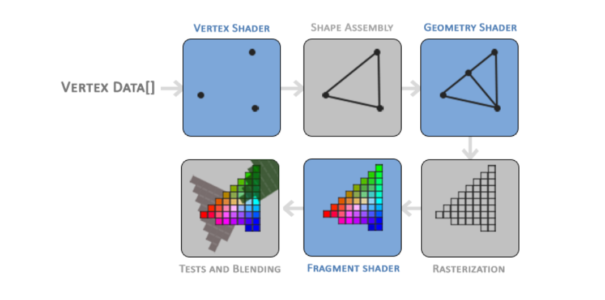
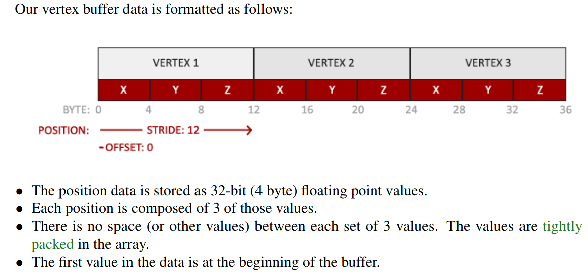
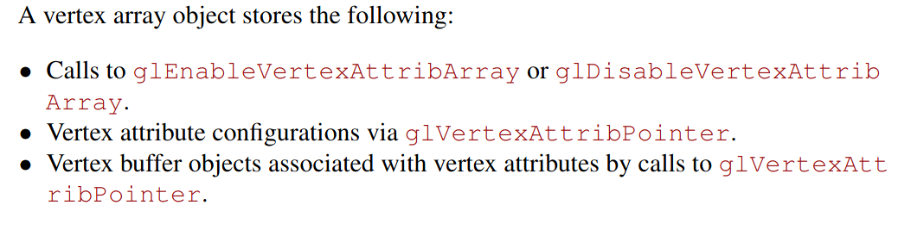
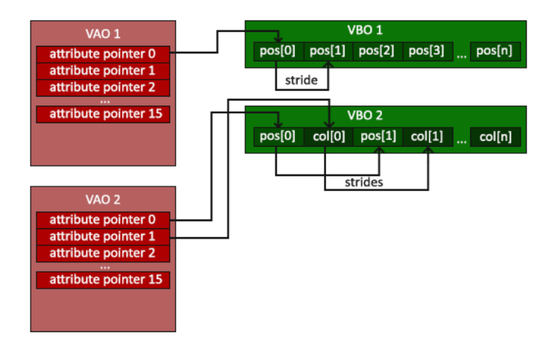
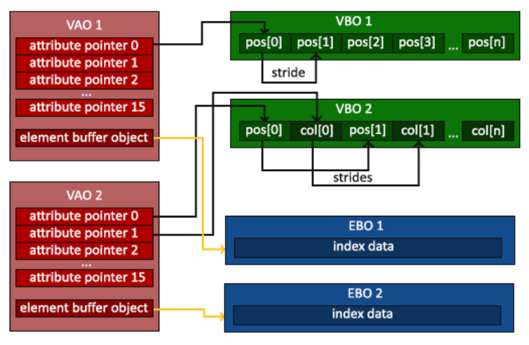
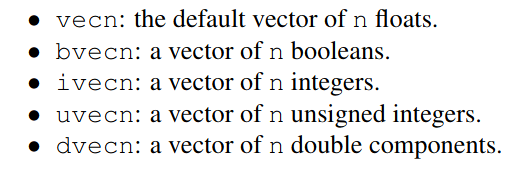
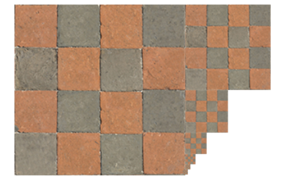

# Learn OpenGL

### [OpenGl3 book](https://learnopengl.com/book/book_pdf.pdf)
## Notes
- Stages of graphics pipeline for shaders:

-  Vertex buffer objects (VBO)
   -  Can store a large number of vertices in the GPU memory. Since sending data to the gpu is costly.
   -  Each VBO has a unique buffer id. Using the buffer id we also need to bind it with a buffer type
- glBufferData(..., ..., ..., GLenum usage)
  - GLenum usage has 3 forms
    - GL_STREAM_DRAW: the data is set only once and used by the GPU at most a few times
    - GL_STATIC_DRAW: the data is set only once and used many times
    - GL_DYNAMIC_DRAW: the data is changed a lot and used many times
- Vertex buffer data

  - Using this map, we can tell opengl how to interpret the vertex data (per vertex attribute)
- Vertex Array Object (VAO)


- Element Buffer Objects (EBO)

  - Reduces the overlap on the vertices specified. For example, drawing a rectangle using 2 triangles will use 6 vertices instead of 4 since 2 overlap each other.
  - EBO is a buffer that stores indices that tells OpenGL what vertices to draw

- Shaders
  - GLSL
    - Supports int, float, double, uint, bool, vectors, matrices
    - Vectors
      
  - OpenGL guarantees that there will always be at least 16 4-component vertex attributes available
  - Vertex shader
    - To define how the vertex data is organized we specify the input variables with location metadata so we can configure the vertex attributes on the CPU
      - Use 
        ```
          layout (location = 0)
        ```
  - Fragment shader
    - Always requires a vec4 color output variable
      - NOTE: failin to initialize an output color will result in a color buffer output that is undefined with possible values begin renders as either black or white
  - Sending data from one shader to another shader
    - Must declare an output variable w/ the same name & type in the sending shader
    - Must declare an input variable w/ the same name & type in the receiving shader
    - When variable name & type are the same in the sending & receiving shader opengl will link and send data when possible
  - Uniforms
    - uniforms are passed our application on the cpu to the shaders on the gpu
    - uniforms are global, unique per shader program.
    - uniforms will keep their values until reset or updated

- Textures
  - Texture Wrapping
    - GL_REPEAT, GL_MIRRORED_REPEAT, GL_CLAMP_TO_EDGE, GL_CLAMP_TO_BORDER
  - Texture filtering
    - GL_NEAREST, GL_LINEAR
  - Mipmaps
    
    - Mipmaps reduces resolution of texture images in order to save memory bandwidth on small objects
    - After a certain distance threshold from the viewer, OpenGl will use a different mipmap texture that best suits the distance to the object
    - Filtering methods for mipmap
      - GL_NEAREST_MIPMAP_NEAREST, GL_LINEAR_MIPMAP_NEAREST, GL_NEAREST_MIPMAP_LINEAR, GL_LINEAR_MIPMAP_LINEAR
    
